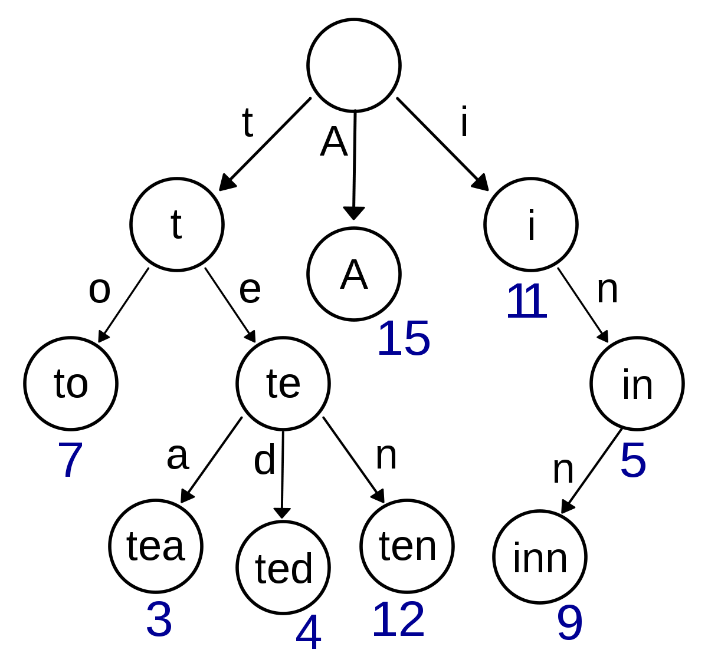

# 트라이(Trie)

트라이(Trie)는 문자열을 저장하고 효울적으로 탐색하기 위한 트리 형태의 자료구조이다.
검색할 시 볼 수 있는 자동완성 기능, 사전검색 등 문자열을 탐색하는 데 특화되어 있다.

## Trie의 장단점
- 문자열 검색을 빠르게 한다.
- 문자열을 탐색할 때, 하나하나씩 전부 비교하면서 탐색을 하는 것보다 시간 복잡도 측면에서 훨씬 더 효율적이다.
- 각 노드에서 자식들에 대한 포인터들을 배열로 모두 저장하고 있다는 점에서 저장 공간의 크기가 크다는 단점도 있다. (메모리 측면에서 비효율적일 수 있음!)

## Trie의 원리
Trie는 주어진 문자열을 이루고 있는 문자를 앞에서부터 하나씩 노드를 생성해가면서 만들어진다.

생성 과정은 다음과 같이 진행된다.

1. 주어진 문자열에서 현재 문자를 가져온다.
2. 현재 문자로 이루어진 노드가 존재한다면 그 노드로 다음 문자열을 탐색하고, 노드가 없다면 그 노드를 새로 할당받은 후, 해당 노드를 통해 다음 문자열을 탐색한다.
3. 문자열의 마지막이 될 때까지 위의 과정을 반복한다.

상세 예시 및 탐색 과정: https://yabmoons.tistory.com/379 참고
